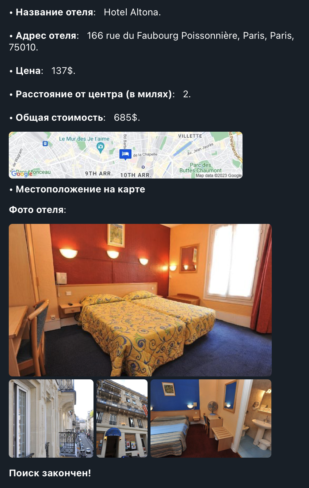

# Поиск отелей в Telegram

## Tурагентство «Too Easy Travel»

Бот позволяет быстро находить отели в мессенджере `telegram` по 
определённым критериям и запросам. 
Опробовать бота можно по адресу: https://t.me/Easyeasy_Travel_Bot 

### Специальные команды бота: 

* Подбирать топ самых дешёвых отелей в заданном городе. 
* Подбирать топ самых дорогих отелей в заданном городе. 
* Подбирать топ отелей, наиболее подходящих по цене и расположению от центра заданного города. 
* Выводить историю поиска отелей.  
* Выводить текст помощи с направлением на меню. 

### Особенности реализации кода проекта: 

* Использование модуля из стандартной библиотеки Python, который позволяет настраивать логирование из скрипта.
* Использование базы данных SQL.
* Запуск проекта осуществляется путем клонирования репозитория. 

### Команды бота:
* **/start** - Старт бота
* **/help** — помощь по командам бота,
* **/lowprice** — вывод самых дешёвых отелей в городе,
* **/highprice** — вывод самых дорогих отелей в городе,
* **/bestdeal** — вывод отелей, наиболее подходящих по цене и расположению от центра.
* **/history** — вывод истории поиска отелей

После выполнения команд lowprice, highprice и bestdeal 
выводятся сообщения с информацией по каждому отелю. 

В эту информацию входит:
* Название отеля
* Адрес отеля
* Цена
* Расстояние от центра города
* Общая стоимость
* Местоположение на карте 
* N фотографий отеля (если пользователь решил их выводить)

### Примеры использования:

*Взята команда /lowprice*

**Меню бота:**

**Варианты выбора количества запрашиваемых фото:**

**Пример результата поиска:**

### Запуск в docker
* Собрать образ: `docker build . -t telebot:latest`
* Запустить: `docker run -d --name telebot -e TELEGRAM_API_TOKEN="6095050306:AAEsvO8Vdvb69Pc5w9v2rcT2gBh66l4c_I0" telebot:latest`
